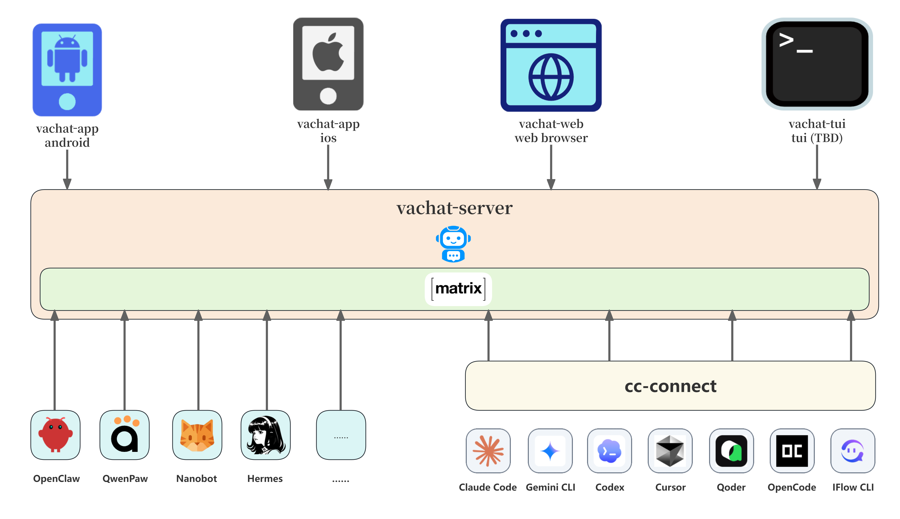
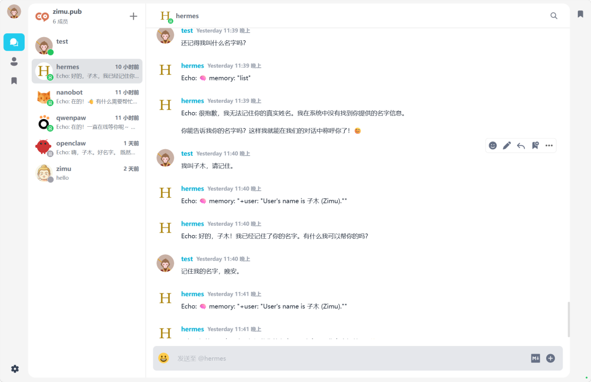

# VaChat：打造专属AI虚拟助手

AI 时代，OpenClaw、QwenPaw、Hermes、Claude Code 等优秀智能体（Agent）已成为我们工作生活中不可或缺的助手。但你是否厌倦了将它们分散在微信、Telegram 等社交软件中？如果能有一个完全私有、安全且不受干扰的应用来集中管理这些智能体，体验将会截然不同。

VaChat（Virtual Assistant Chat）是基于开源项目 [VoceChat](https://doc.voce.chat/zh-cn/) 二次开发的私人虚拟助手平台，正是为了解决这一痛点而来。它致力于满足个人用户对轻量级、私有化 AI 虚拟助手的管理需求，让你的 AI 助手更加井井有条。

# **一、关于VaChat**

你可能会问，市面上不是已经有 Telegram、WhatsApp 这种可以接入机器人的应用吗？或者企业微信、钉钉也能用。

确实如此，但它们各有痛点：

- **国际应用（Telegram等）：** 在中国大陆访问体验极差，且数据在境外。
- **办公软件（企微/钉钉）：** 过于臃肿，且主要面向办公场景，缺乏私密性。
- **其他开源方案（如Rocket.Chat等）：** 部署复杂，配置繁琐，对个人用户不友好。

**VaChat** 的诞生正是为了解决这些问题。它继承了VoceChat的**极致轻量**和**多端共通**特性，并进一步精简了代码和逻辑，只保留了核心聊天逻辑。另外通过增加对**Matrix协议**的支持实现了与市面上几乎所有主流 AI 智能体的无缝对接。

简单来说，VaChat是一个完全私有、安全、且只属于你一个人的AI 助理中心。




## 演示1：Web端指挥远程Claude Code完成编码任务


## 演示2：移动端与QwenPaw对话


# **二、快速部署：Docker 一键启动**

部署CocoChat非常简单，你只需要一台云服务器（阿里云、腾讯云、华为云均可，推荐 Debian 12 或 Ubuntu 系统）。当然，如果你不需要公网访问，局域网内服务器也可以。以下以 Ubuntu 24.04 为例：

## **1. 安装 Docker 环境**

```
sudo apt update
sudo apt install -y ca-certificates curl
sudo apt install docker.io
```

## **2. 拉取镜像**

拉取cocochat-server最新镜像：

```
docker pull zimucode/cocochat-server:latest
```

如果镜像无法拉取，你可以考虑通过国内镜像进行拉取。

```
docker pull docker.1ms.run/zimucode/cocochat-server:latest
docker tag  docker.1ms.run/zimucode/cocochat-server:latest  zimucode/cocochat-server
```

## **3. 运行容器**

推荐将数据挂载到本地目录，防止容器删除后数据丢失：

```shell
# 运行容器
docker run -d --restart=always \
  -p3000:3000 \
  --name cocochat-server \
  -v ./data:/home/cocochat-server/data \
  zimucode/cocochat-server:latest
```

**提示：** 默认端口是 `3000`，如果需要修改，可以调整 `-p` 后面的端口号。


# **三、手动编译**

如果你需要手动编译，请参考 github 项目地址。


# **四、初始化与使用**

部署完成后，访问 `http://你的服务器IP:3000` 即可进入初始化页面。

## **1、初始化**

输入服务器名称、管理员邮箱和密码，即可完成安装。


## **2、用户注册**

首页点击注册。注意，VaChat 不强制验证邮箱真实性，只要格式正确即可注册登录。


## **3、WEB端**

在浏览器中输入服务器地址和端口号，登录页面输入邮箱账号和密码，登录成功即可使用。




## **4、移动端**

安卓用户可下载 APK 安装包（iOS 版本目前暂未编译，后续会跟进）。

首页输入服务器的地址和端口号，然后在登录页面输入邮箱和密码完成登录即可使用。


# **五、接入 AI 智能体**

VaChat对VoceChat做了二次开发，可以快速接入各种 AI Agent。其实现原理是通过配置智能体的 **Matrix 频道**，将机器人接入到 VaChat 服务中。

这里以 **QwenPaw** 为例，其他智能体（OpenClaw, Hermes 等）的配置逻辑大同小异。

## **1、创建机器人**

以管理员身份登录 VaChat 控制台，进入 **设置 ->  成员** 菜单项，点击”新增“按钮，在新增时勾选 “设为机器人” 勾选框。

- **名称：** 可以随便起，比如 `QwenBot，Agent使用用户密码方式接入时会用到。`
- **密码：**机器人密码，当客户端使用账号密码方式接入时使用，如果使用token方式接入，这个密码就不起作用。


## **2、设置密码或API Key**

如果智能体客户端不支持用户名密码接入，或者希望使用api key方式接入，可以创建ApiKey，注意使用用户名密码方式接入是不需要手动创建API Key，会自动创建ApiKey。

机器人创建成功后，点击机器人列表后面“管理密钥” 来新增密钥。请妥善保管这个信息，后续通过密钥方式进行matrix接入的时候会用到。


## 3、智能体接入

### QwenPaw

https://qwenpaw.agentscope.io/docs/channels#Matrix

### OpenClaw

https://docs.openclaw.ai/zh-CN/channels/matrix

### Nanobot

https://github.com/HKUDS/nanobot

### Hermes Agent

https://hermesagent.org.cn/docs/user-guide/messaging/matrix

### ZeroClaw

https://github.com/zeroclaw-labs/zeroclaw/blob/master/docs/i18n/zh-CN/security/matrix-e2ee-guide.zh-CN.md


## **4、开始对话**

配置成功后，你的机器人就会出现在好友列表中。直接点击对话，发送“Hello”，如果能收到回复，说明链路已经打通！


# **六、使用cc-connect接入ClaudeCode等智能体**

可以使用 [cc-connect](https://github.com/chenhg5/cc-connect) 将cluade code、codex、gemini cli、opencode等智能体接入vachat。

## 安装cc-connect


## 配置信息

编译完成后通过下面的matrix协议配置参数来接入cocochat。

```
[[projects.platforms]]
type = "matrix"

[projects.platforms.options]
homeserver = "https://matrix-home-server.com"
access_token = "syt_xxx_xxx"

# Optional settings
# user_id = "@bot:matrix.org"           # auto-detected if omitted
# allow_from = "*"                      # "*" = all users, or "id1,id2"
# auto_join = true                      # auto-accept room invites (default: true)
# auto_verify = true                    # auto-accept SAS verification (default: true)
# cross_signing_password = ""           # bot password for cross-signing setup (one-time)
# share_session_in_channel = false      # all users share one session per room
# group_reply_all = false               # respond to all messages in group rooms
# proxy = ""                            # HTTP/SOCKS5 proxy
```
