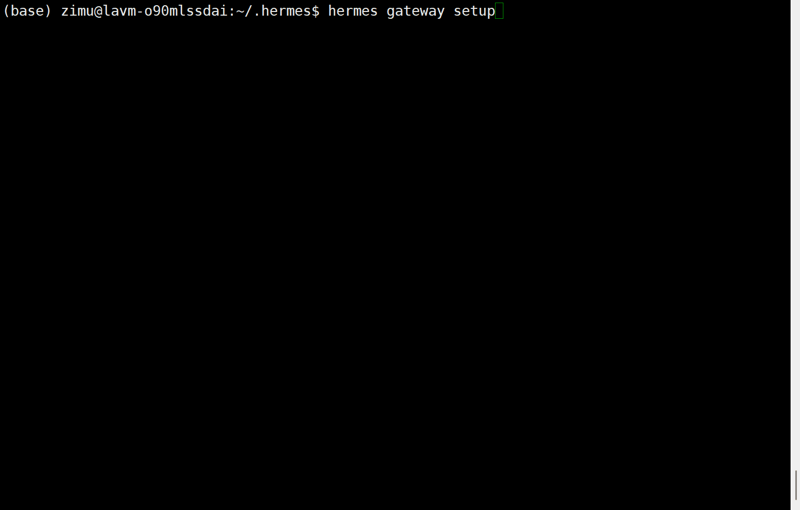

# Hermes

详细设置可以参考：[Matrix | Hermes Agent](https://hermes-agent.nousresearch.com/docs/zh-Hans/user-guide/messaging/matrix)


# 1、安装 Hermes

Hermes 提供一键安装脚本，会自动安装全部依赖（Python、Node.js、ripgrep、ffmpeg 等），无需手动准备环境。

**Linux / macOS：**

```bash
curl -fsSL https://hermes-agent.nousresearch.com/install.sh | bash
```

**Windows（原生运行，无需 WSL）：**

```powershell
iex (irm https://hermes-agent.nousresearch.com/install.ps1)
```

安装完成后，**重新打开终端**使 `hermes` 命令生效。完整说明见官方[安装文档](https://hermes-agent.nousresearch.com/docs/zh-Hans/getting-started/installation)。

# 2、创建机器人账户

机器人账户在 VaChat 中创建：以管理员身份登录控制台，进入 **设置 → 成员**，新增成员时勾选“设为机器人”。详细步骤参考 [index.md](./index.md)。

创建后请记下机器人的**用户 ID**（如 `@hermes:zimu.pub`）和**密码**，下一步如果采用**”方式B：密码登录”**会用到。

# 3、获取访问令牌

Hermes 连接 homeserver 需要身份凭证，支持以下两种方式：

## 方式 A：访问令牌（推荐）

无需暴露密码，安全性更高。在 VaChat 控制台机器人列表中点击“管理密钥”生成 API Key，并妥善保存。操作细节参考 [index.md](./index.md) 中的“设置 API Key”。

## 方式 B：密码登录

直接使用机器人的用户 ID 和密码，Hermes 启动时自动登录。配置更简单，但密码会明文保存在 `.env` 文件中。

```
MATRIX_USER_ID=@hermes:zimu.pub
MATRIX_PASSWORD=your-password
```


# 4、配置 Hermes Agent

## 方式 A：交互式设置（推荐）

运行引导式设置命令：

```
hermes gateway setup
```

在提示时选择 **Matrix**，然后按提示提供你的 homeserver URL、访问令牌（或用户 ID + 密码）以及允许的用户 ID。




## 方式B: 手动配置

将以下内容添加到你的 `~/.hermes/.env` 文件：

**使用访问令牌：**

```ini
# 必填
MATRIX_HOMESERVER=https://chat.zimu.pub
MATRIX_ACCESS_TOKEN="your_access_token"

# 可选：用户 ID（如省略则从令牌自动检测）
# MATRIX_USER_ID=@hermes:zimu.pub

# 安全：限制可与机器人交互的用户
MATRIX_ALLOWED_USERS=@test:zimu.pub

# 多个允许用户（逗号分隔）
# MATRIX_ALLOWED_USERS=@test:zimu.pub,@admin:zimu.pub

# 是否需要@
MATRIX_REQUIRE_MENTION=false

MATRIX_ALLOWED_ROOMS=!dm_5_2:zimu.pub,!dm_1_2:zimu.pub,!group_19:zimu.pub
MATRIX_HOME_ROOM=!dm_5_2:zimu.pub
MATRIX_HOME_ROOM_THREAD_ID=$1849
```

**使用密码登录：**

```ini
# 必填
MATRIX_HOMESERVER=https://chat.zimu.pub
MATRIX_USER_ID=@hermes:zimu.pub
MATRIX_PASSWORD=Hermes@123

# 安全：限制可与机器人交互的用户
MATRIX_ALLOWED_USERS=@test:zimu.pub

# 多个允许用户（逗号分隔）
# MATRIX_ALLOWED_USERS=@test:zimu.pub,@admin:zimu.pub

# 是否需要@
MATRIX_REQUIRE_MENTION=false

MATRIX_ALLOWED_ROOMS=!dm_5_2:zimu.pub,!dm_1_2:zimu.pub,!group_19:zimu.pub
MATRIX_HOME_ROOM=!dm_5_2:zimu.pub
MATRIX_HOME_ROOM_THREAD_ID=$1849
```


# 5、启动gateway

配置完成后，启动 gateway：

```
hermes gateway
```

机器人应在几秒内连接到你的 homeserver 并开始同步。发送一条消息——DM 或机器人已加入的房间——进行测试。

如果希望打印gateway的日志信息，可以使用run命令并带上参数  -v 或 -vv 。 -v 表示打印INFO日志，-vv表示打印DEBUG日志。

```
hermes gateway run -vv
```


# 6、常见问题

## a. 发消息不响应

**原因**：一般是因为 `MATRIX_ALLOWED_USERS` 中不包含你的用户 ID。

**解决方法**：确认你的用户 ID 在 `MATRIX_ALLOWED_USERS` 中（使用完整的 `@user:server` 格式）。重启 gateway。

如果后台出现如下提示，则表示是因为安全限制不允许机器人回复你的消息。

```
WARNING gateway.run: Unauthorized user: @zimu:zimu.pub (zimu) on matrix
```

在 ~/hermes/.env 的配置项 MATRIX_ALLOWED_USERS 加上用户ID。

```
MATRIX_ALLOWED_USERS=@test:zimu.pub,@admin:zimu.pub,@zimu:zimu.pub
```

