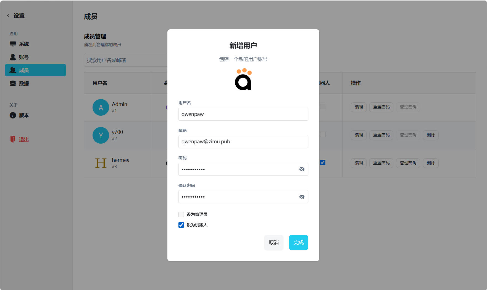
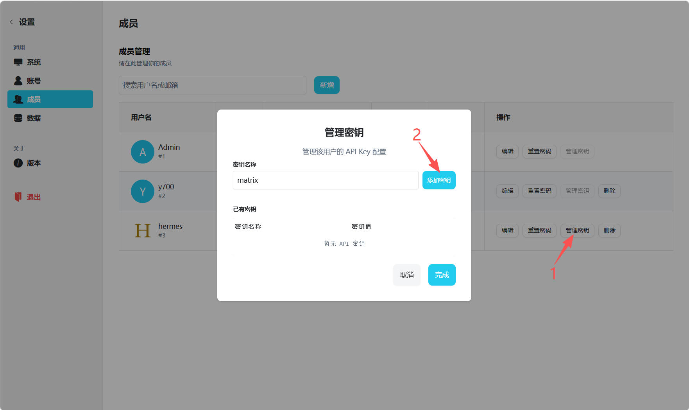
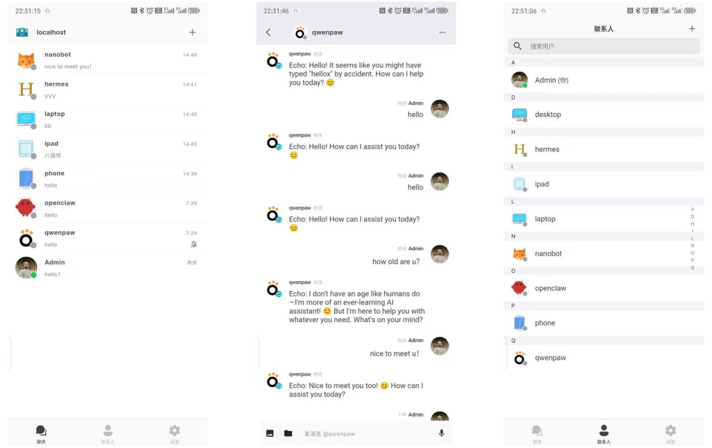

# 接入智能体

VaChat 在 VoceChat 基础上做了二次开发，可以快速接入各种 AI Agent。其实现原理是通过配置智能体的 **Matrix 频道**，将机器人接入到 VaChat 服务中。

本文以 **QwenPaw** 为例演示完整接入流程，其他智能体（OpenClaw、Hermes 等）的配置逻辑大同小异。

## 1、创建机器人

以管理员身份登录 VaChat 控制台，进入 **设置 → 成员** 菜单项，点击"新增"按钮，并在新增时勾选"设为机器人"。

- **名称：** 机器人名称，可随意填写，例如 `QwenBot`。客户端使用账号密码方式接入时会用到。
- **密码：** 机器人密码。客户端使用账号密码方式接入时使用；如果改用 Token 方式接入，此密码不生效。

## 2、设置密码或 API Key

机器人接入 VaChat 有两种鉴权方式：

- **账号密码方式：** 无需手动创建 API Key，系统会自动生成。
- **API Key 方式：** 适用于不支持账号密码接入的智能体客户端，需手动创建 API Key。

如需使用 API Key 方式，在机器人创建成功后，点击机器人列表中的"管理密钥"来新增密钥。请妥善保管该密钥，后续通过密钥方式进行 Matrix 接入时会用到。

## 3、智能体接入

目前 VaChat 已适配以下智能体，接入详情请参考对应文档：

- [QwenPaw](./qwenpaw.md)：基于通义千问的智能体，本文以它为例演示完整接入流程。
- [OpenClaw](./openclaw.md)：基于 OpenAI 兼容协议的通用智能体。
- [Hermes](./hermes.md)：面向运维场景的智能体。
- [Nanobot](./nanobot.md)：轻量级嵌入式智能体。

## 4、开始对话

配置成功后，机器人会出现在好友列表中。直接点击对话，发送"Hello"，如果能收到回复，说明链路已经打通！

