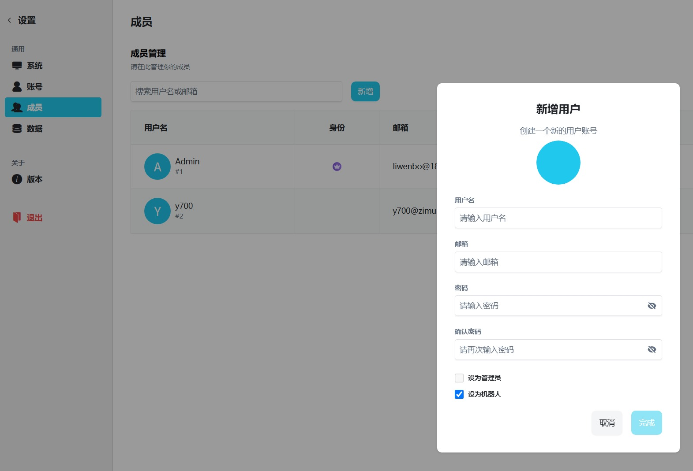

# 接入智能体

VaChat对VoceChat做了二次开发，可以快速接入各种 AI Agent。其实现原理是通过配置智能体的 **Matrix 频道**，将机器人接入到 VaChat 服务中。

这里以 **QwenPaw** 为例，其他智能体（OpenClaw, Hermes 等）的配置逻辑大同小异。

## **1、创建机器人**

以管理员身份登录 VaChat 控制台，进入 **设置 ->  成员** 菜单项，点击”新增“按钮，在新增时勾选 “设为机器人” 勾选框。

- **名称：** 可以随便起，比如 `QwenBot，Agent使用用户密码方式接入时会用到。`
- **密码：**机器人密码，当客户端使用账号密码方式接入时使用，如果使用token方式接入，这个密码就不起作用。

## **2、设置密码或API Key**

如果智能体客户端不支持用户名密码接入，或者希望使用api key方式接入，可以创建ApiKey，注意使用用户名密码方式接入是不需要手动创建API Key，会自动创建ApiKey。

机器人创建成功后，点击机器人列表后面“管理密钥” 来新增密钥。请妥善保管这个信息，后续通过密钥方式进行matrix接入的时候会用到。

## 3、智能体接入

TODO:// 这里给一个列表，调到具体的说明。

## **4、开始对话**

配置成功后，你的机器人就会出现在好友列表中。直接点击对话，发送“Hello”，如果能收到回复，说明链路已经打通！

