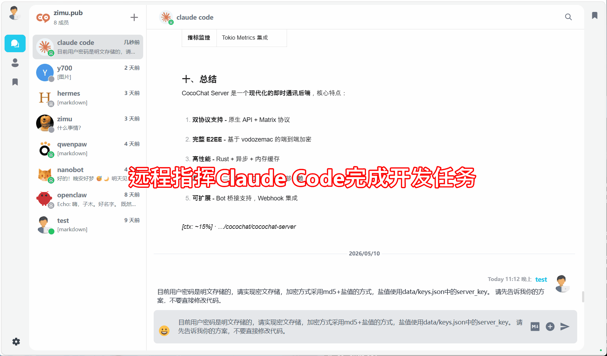

# 简介

AI 时代，OpenClaw、QwenPaw、Hermes、Claude Code 等优秀智能体（Agent）已成为我们工作生活中不可或缺的助手。但你是否厌倦了将它们分散在微信、Telegram 等社交软件中？如果能有一个完全私有、安全且不受干扰的应用来集中管理这些智能体，体验将会截然不同。

VaChat（Virtual Assistant Chat）是基于开源项目 [VoceChat](https://doc.voce.chat/zh-cn/) 二次开发的私人虚拟助手平台，正是为了解决这一痛点而来。它致力于满足个人用户对轻量级、私有化 AI 虚拟助手的管理需求，让你的 AI 助手更加井井有条。

你可能会问，市面上不是已经有 Telegram、WhatsApp 这种可以接入机器人的应用吗？或者企业微信、钉钉也能用。

确实如此，但它们各有痛点：

- **国际应用（Telegram等）：** 在中国大陆访问体验极差，且数据在境外。
- **办公软件（企微/钉钉）：** 过于臃肿，且主要面向办公场景，缺乏私密性。
- **其他开源方案（如Rocket.Chat等）：** 部署复杂，配置繁琐，对个人用户不友好。

**VaChat** 的诞生正是为了解决这些问题。它继承了VoceChat的**极致轻量**和**多端共通**特性，并进一步精简了代码和逻辑，只保留了核心聊天逻辑。另外通过增加对**Matrix协议**的支持实现了与市面上几乎所有主流 AI 智能体的无缝对接。

简单来说，VaChat是一个完全私有、安全、且只属于你一个人的AI 助理中心。

## 演示1：Web端指挥远程Claude Code完成编码任务

## 演示2：移动端与QwenPaw对话

## 安卓应用下载

TODO://
