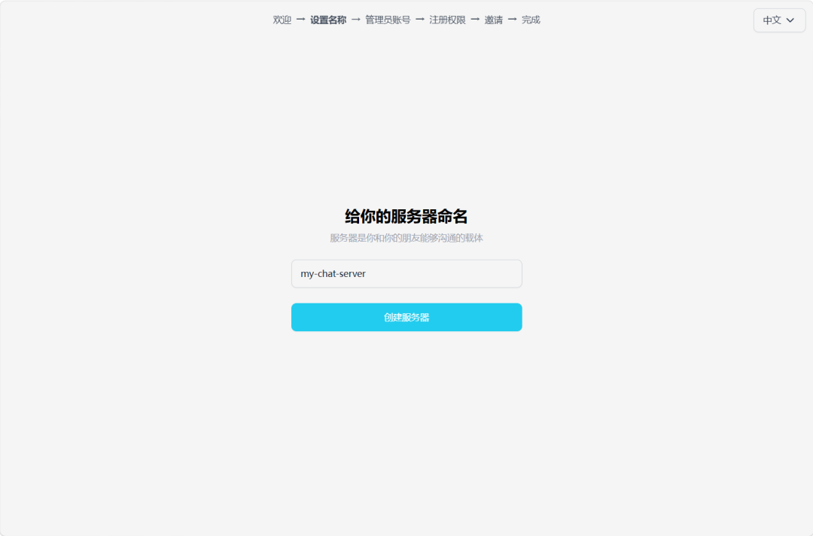
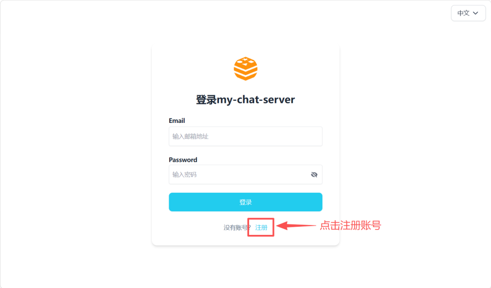

# 初始化和使用

部署完成后，访问 `http://你的服务器IP:3000` 即可进入初始化页面。

## **1、初始化**

输入服务器名称、管理员邮箱和密码，即可完成安装。

## **2、用户注册**

首页点击注册。注意，vachat 不强制验证邮箱真实性，只要格式正确即可注册登录。

## **3、WEB端**

在浏览器中输入服务器地址和端口号，登录页面输入邮箱账号和密码，登录成功即可使用。

## **4、移动端**

安卓用户可下载 APK 安装包（iOS 版本目前暂未编译，后续会跟进）。

首页输入服务器的地址和端口号，然后在登录页面输入邮箱和密码完成登录即可使用。

